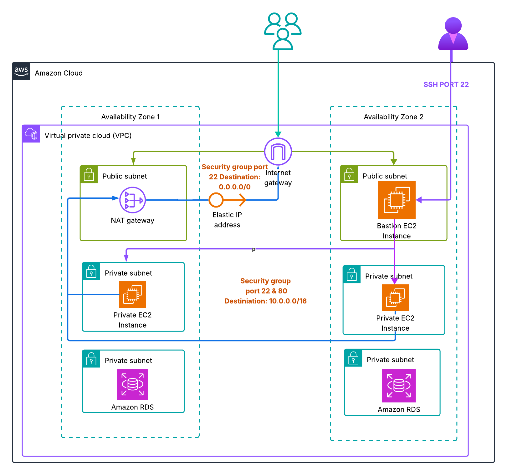

# 🌐 Terraform AWS Three-Tier Architecture  
### 🏗️ Phase 1 — Networking

---

## 📖 Overview  

This project provisions a **production-grade three-tier architecture on AWS** using **Terraform** as Infrastructure-as-Code (IaC).  

**Phase 1** focuses on setting up the **networking foundation**, the backbone that enables a scalable, secure, and highly available application environment across **two Availability Zones (AZs)**.  

Subsequent phases will add:  
- EC2 Auto Scaling Groups (Application Tier)  
- RDS Multi-AZ Database (Database Tier)  
- Application Load Balancer (Web Tier)  
- CloudWatch Monitoring and Alerts  

---

## Objective  

Design and deploy a **VPC network infrastructure** following AWS best practices to serve as the base for hosting enterprise-level workloads.  

This phase ensures:  
- **High Availability:** Multi-AZ design for fault tolerance.  
- **Network Isolation:** Public, private-app, and private-db subnets for layered security.  
- **Controlled Internet Access:** Public subnets host internet-facing components, private subnets remain isolated.  
- **Scalability:** Modular Terraform structure to support future phases.  

---

## 🏗️ Architecture Design  

### 🕸️ Network Topology  

| Component | Description |
|------------|-------------|
| **VPC** | `10.0.0.0/16` — custom CIDR block for isolated networking |
| **Public Subnets (2)** | For NAT Gateways, Load Balancers, Bastion Hosts |
| **Private-App Subnets (2)** | For EC2 Auto Scaling Group (application tier) |
| **Private-DB Subnets (2)** | For RDS instances (database tier) |
| **Internet Gateway (IGW)** | Enables external connectivity for public subnets |
| **NAT Gateways (2)** | One per AZ for redundancy — secure outbound access for private subnets |
| **Route Tables** | Individual route tables per subnet type |
| **VPC Flow Logs** | Captures traffic for security analysis via CloudWatch Logs |

---

## 📊 Architecture Diagram  


>   

**Diagram Description:**  
A VPC spanning two Availability Zones with isolated subnets for web, application, and database tiers. Public subnets are connected to an Internet Gateway, while private subnets route traffic through NAT Gateways for secure outbound communication.  

---


## ⚙️ Requirements
### 🧰 Tools

- Terraform ≥ 1.5.0

- AWS CLI (configured with IAM credentials)

- Git & GitHub

### 💰 Cost Note: NAT Gateways incur charges (~$30/month each). For testing, you may deploy one NAT Gateway in a single AZ.

## Deployment  

### **1. Clone the Repository**
```bash
1. Clone the Repository
git clone https://github.com/<your-username>/terraform-aws-3tier.git
cd terraform-aws-3tier/envs/dev

2. Initialize Terraform
terraform init 

3. Validate Configuration
terraform validate

4. Preview Infrastructure Plan
terraform plan

5. Apply Changes
terraform apply -auto-approve

---

🧹 Clean Up
1. Destroy Infrastructure
terraform destroy -auto-approve

2. Delete Local Terraform Files
rm -rf .terraform*
rm -rf terraform.tfstate*